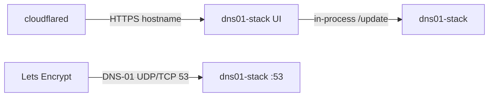

# Wiki

How public DNS, port 53, and this stack fit together. The [README](../README.md) is the operator guide; these pages are the networking story behind DNS-01.

## Pages

- [Public DNS and port 53](Public-DNS-and-port-53.md) — why Let's Encrypt must reach this box on 53
- [Cloudflared and DNS](Cloudflared-and-DNS.md) — why the tunnel feels magical and still cannot carry DNS-01
- [Certificate checklist](Certificate-checklist.md) — CNAME, glue, forward, then Apply in the Certs UI

## Two paths

The UI talks to acme-dns **in-process** inside `dns01-stack`. Let's Encrypt does **not**. Validators only do a public DNS lookup. Those two paths are easy to mix up.

HTTP UI traffic can go through cloudflared. Port 53 cannot.
