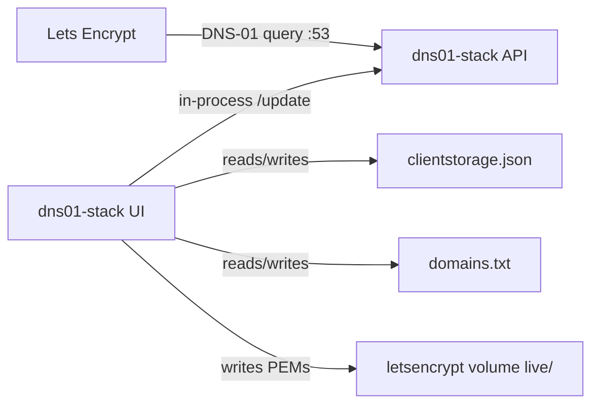

# DNS01 Stack

Grouped and nested wildcards on one certificate — register the apex once, chain `_acme-challenge` CNAMEs, 100 TXT slots (vs 2 on upstream acme-dns).

## Why dns01-stack?

Standard [acme-dns](https://github.com/acme-dns/acme-dns) (and the public `auth.acme-dns.io` service) caps each account at **two** TXT challenge slots — effectively `example.com` and `*.example.com`. Nested wildcards on one certificate need more slots and a smarter issuer.

This stack groups many wildcards on a **single** `domains.txt` line and one cert:

- **Implied parent wildcards** — `*.app.example.com` also adds `*.example.com` on the certificate when needed
- **One registration** — register the line apex in the UI; the issuer walks parent keys in `clientstorage.json`
- **CNAME chaining** — nested zones point `_acme-challenge.<zone>` at the apex challenge name, not a new UUID per wildcard
- **100 TXT slots** — enough simultaneous challenges for large SAN groups (upstream keeps two)

Example line (order does not matter):

```txt
example.com *.example.com *.app.example.com *.api.example.com
```

Register `example.com` once, publish the apex CNAME, chain nested `_acme-challenge` names, then **Save** and **Apply** in the Certs UI. See [`.wiki/Certificate-checklist.md`](.wiki/Certificate-checklist.md).

| Service | What it does |
| --- | --- |
| `dns01-stack` | Nuxt/Node [acme-dns](https://github.com/acme-dns/acme-dns) on `:53` **plus** operator UI, clientstorage, and ACME issue/renew (client lives as `plugins/client`) |



## Certificates in the client

Edit `data/dns01_host/domains.txt` on the host or in the **Certs** UI. **Save** validates format only. **Apply** runs ACME (DNS-01 via acme-dns).

- **Production** (default) writes `/etc/letsencrypt/live/<cert-name>/`
- **Staging** writes `/etc/letsencrypt/staging/<cert-name>/` and never touches `live/`
- A renew timer refreshes **production** certs within ~30 days of expiry
- Removing a line from `domains.txt` leaves PEMs on disk (orphans). Use **Trash** → Undo or permanent delete

Consumers bind the same Certbot-style paths:

```yaml
volumes:
  - letsencrypt:/etc/letsencrypt:ro
```

Upstream acme-dns only keeps two TXT records per account. This stack’s Nuxt server keeps **100 rolling TXT slots**. Rebuild `dns01-stack` when issuing many SANs on one account.

`domains.txt` expands nested wildcards (implied parent wildcards). Line order does not matter — shortest apex is the cert-name. Register the line apex in the UI; the issuer walks parent keys in `clientstorage.json`.

## Ports

### `dns01-stack`

| Container | Host | Notes |
| --- | --- | --- |
| `53/tcp` | `53` | DNS. Let's Encrypt hits this. |
| `53/udp` | `53` | Same. |
| `80/tcp` | `8080` | UI + register/update API (always). |
| `443/tcp` | `8443` | Same API over HTTPS when `api.tls = "cert"`. |

**Recommended** host mapping is `80:80` and `443:443` when nothing else owns those ports. The example compose uses **8080** / **8443** when a front proxy already holds 80/443 (e.g. Synology DSM) — point Cloudflared, Nginx Proxy Manager, Tailscale (TSDProxy), Synology reverse proxy, or similar at those host ports. Port **53** stays on the host; tunnels do not carry DNS-01.

DNS has to be public; keep the UI behind your LAN / tunnel.

Public `:53` must reach the host that runs this stack — not a dev laptop behind NAT unless you forward port 53. See [`.wiki/Home.md`](.wiki/Home.md).

## Quick start

```bash
cp .env.example .env
cp docker-compose.yml.example docker-compose.yml
cp docker-compose.override.yml.example docker-compose.override.yml
docker compose up -d --build
```

Docker creates `data/` for you. On first start the container writes:

- `data/dns01_config/config.cfg`
- `data/dns01_host/domains.txt` (seeded if missing)
- `clientstorage.json` on the `dns01-config` volume (`{}` if empty)

1. `config.cfg` — your auth hostname, NS, admin, public IP.
2. `domains.txt` — one certificate per line. Edit in the Certs UI or on disk; Save validates; Apply issues. Example: `example.com *.example.com *.app.example.com`. `#` and `;` start comments.
3. `.env` — at least `LETSENCRYPT_EMAIL`. For grouped SAN certs, rebuild `dns01-stack` from this tree (100 TXT slots).
4. CNAME `_acme-challenge.<apex>` → `fulldomain` in `clientstorage.json`. Nested zones CNAME to `_acme-challenge.<apex>`.
5. Optional: attach the external `cloudflared` network (see `docker-compose.override.yml.example`).

If Docker created a *directory* named `domains.txt`, remove it (`rm -rf data/dns01_host/domains.txt`) and start again.

## Config

| File | |
| --- | --- |
| `.env` | Copy from `.env.example`. Gitignored. |
| `docker-compose.yml` | Copy from `docker-compose.yml.example`. Gitignored. |
| `docker-compose.override.yml` | Copy from `docker-compose.override.yml.example`. Gitignored. |
| `docker-compose.dev.yml` | Compose profile `dev` — `bun run dev` with bind-mounted `build/dns01-stack`. |
| `data/dns01_config/config.cfg` | Listen address, zone, API. |
| `data/dns01_host/domains.txt` | What to issue (also edited in the Certs UI). |
| `clientstorage.json` (volume `dns01-config`) | acme-dns logins. Not Let's Encrypt. |

### Environment (`.env` → `dns01-stack`)

| Variable | Example | |
| --- | --- | --- |
| `ACMEDNS_URL` | `https://auth.example.org` | Public identity for register/update. Loopback or a host matching `config.cfg` `domain` still runs in-process; that public URL is what gets stored. Compose also uses this as the Register form default unless `NUXT_PUBLIC_DEFAULT_ACMEDNS_URL` is set. |
| `LETSENCRYPT_EMAIL` | `admin@example.com` | ACME account contact. |
| `RENEW_INTERVAL` | `12` | Hours between production renew checks. |
| `CERTS_ACME_ENABLED` | `true` | Set `false` to disable issue/renew (editor still works). |
| `TZ` | `UTC` | Clock. |

Set `ADMINISTRATOR_PASSWORD` to lock the UI behind username `admin`.

`NUXT_APPLICATIONS_DATA_ROOT` defaults to `/app/data` in Compose. Backups go to `/app/data/dns01/backups`.

## Volumes

| Volume | Who | Inside the container |
| --- | --- | --- |
| `letsencrypt` | `dns01-stack` rw | `/etc/letsencrypt` (`live/`, `staging/`, `trash/`) |
| `dns01-config` | `dns01-stack` rw | `/app/config` (`clientstorage.json`, cert settings) |
| `dns01-data` | `dns01-stack` rw | `/app/data` |
| `./data/dns01_config` | `dns01-stack` | `/etc/acme-dns` |
| `./data/dns01_data` | `dns01-stack` | `/var/lib/acme-dns` |
| `./data/dns01_host` | `dns01-stack` | `/config/host` — `domains.txt` |

## Networks

Default compose network: single `dns01-stack` service. UI and acme-dns API share the process. HTTP on `:80` is always on; set `api.tls = "cert"` in `config.cfg` to also serve HTTPS on `:443` (host `8443`).

| `config.cfg` `[api]` | Container | Host (compose) |
| --- | --- | --- |
| `tls = "none"` | HTTP `:80` | `8080` |
| `tls = "cert"`, `port = "443"` | HTTP `:80` + HTTPS `:443` | `8080` + `8443` |

`cloudflared` (external): attach the same service. Port 53 stays on the host, not the tunnel.

More on DNS-01 and networking: [`.wiki/Home.md`](.wiki/Home.md).

## Layout

```
docker-compose.yml.example
docker-compose.override.yml.example
docker-compose.dev.yml
.env.example
.wiki/
build/dns01-stack/          # DNS + API + UI plugin (plugins/client)
data/                       # gitignored — created on first run
```

## Local development

On the host:

```bash
cd build/dns01-stack
bun install
ACME_DNS_CONFIG=./config/config.cfg bun run dev
```

Or in Docker (Compose profile `dev` — runs `bun run dev` with a bind-mounted source tree):

```bash
bun run docker:dev
# equivalent: docker compose -f docker-compose.dev.yml --profile dev up --build
```

UI on `http://127.0.0.1:3000`; DNS on host port `15353`.

See [`build/dns01-stack/README.md`](build/dns01-stack/README.md) for API ports and Docker mount paths.
